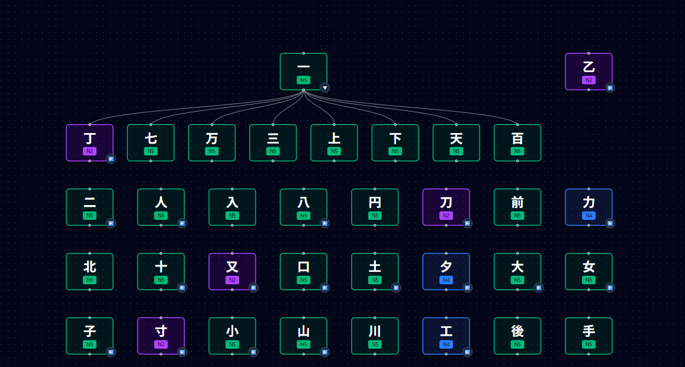
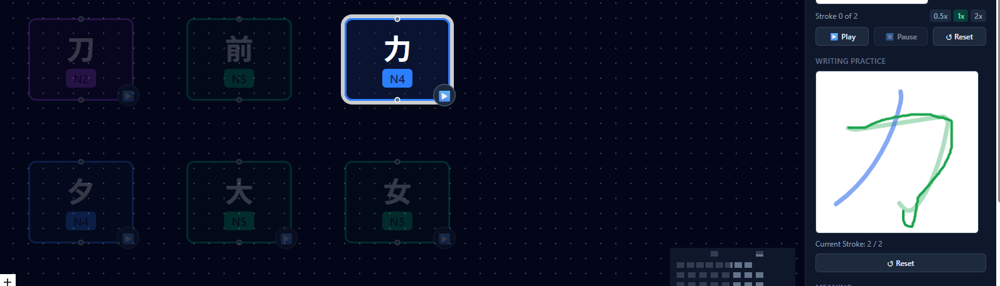
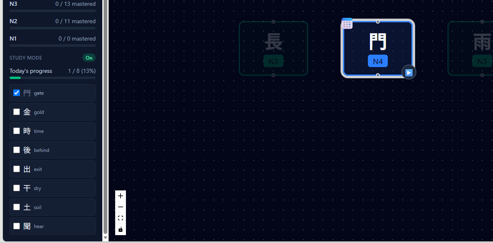

<div align="center">

# 🈶 KanjiGraph

### Learn Kanji Through Relationships, Structure, and Writing Practice

An interactive graph-based Kanji learning platform inspired by Kanji60s.

Explore Kanji as a connected knowledge graph, master stroke order, practice writing, and learn through visual relationships rather than isolated memorization.

🚀 Live Demo: [Kanji Graph](https://ihchowdhury.github.io/kanji-graph/)

</div>

---

# 📖 Overview

KanjiGraph transforms Kanji learning into an interactive visual experience.

Instead of memorizing thousands of isolated characters, learners can explore how Kanji are connected through radicals, components, and evolution paths.

Example:

```text
人
├── 休
├── 体
├── 住
└── 何

木
├── 本
├── 林
└── 森
```

Understanding relationships helps learners remember faster and retain longer.

---

# ✨ Key Features

## 🌳 Interactive Kanji Knowledge Graph

Visualize Kanji relationships as an expandable graph.

- Parent-child relationships
- Component decomposition
- Learning paths
- Dynamic graph expansion
- Auto-layout visualization

---

## 🔍 Smart Search

Search by:

- Kanji character
- Meaning
- Learning graph node

Instant graph focus and navigation.

---

## 🎯 JLPT Learning Support

Filter Kanji by level:

- N5
- N4
- N3
- N2
- N1

Perfect for structured exam preparation.

---

## 🧭 Learning Paths

Understand how Kanji evolve from simpler components.

Example:

```text
木
 ↓
林
 ↓
森
```

Visual learning paths help learners see relationships and progression.

---

## 🎨 Path Highlighting

Select a Kanji and immediately see:

✅ Related components

✅ Parents

✅ Children

✅ Learning family

Unrelated nodes automatically fade to reduce visual noise.

---

## 📝 Writing Practice Mode

Practice writing Kanji directly inside the application.

Features:

- Interactive writing canvas
- Guided practice mode
- Stroke-by-stroke learning
- Attempt history tracking

---

## ✏️ Stroke Order Validation

Unlike simple drawing tools, KanjiGraph validates correct Kanji writing order.

Features:

✅ Stroke count validation

✅ Guided strokes

✅ Stroke order enforcement

✅ Writing progress tracking

Learners must follow the correct writing sequence.

---

## 📊 Progress Tracking

Monitor learning progress:

- Mastered Kanji
- Learning statistics
- Practice history
- Local progress persistence

---

## 🎯 Study Mode

Create focused learning sessions.

Features:

- Daily Kanji targets
- Progress indicators
- Structured study workflow

---

# 🏗 Architecture

```text
React
  │
  ├── React Flow
  ├── Zustand
  ├── TailwindCSS
  │
  └── Kanji Dataset
          │
          ├── Relationships
          ├── Components
          ├── Stroke Data
          └── Learning Paths
```

---

# 🛠 Technology Stack

### Frontend

- React
- TypeScript
- Vite
- TailwindCSS

### Visualization

- React Flow

### State Management

- Zustand

### Deployment

- GitHub Pages

### Data Sources

- KanjiVG
- KANJIDIC2

---

# 📷 Screenshots

### Knowledge Graph



### Writing Practice



### Study Mode



---

# 🚀 Getting Started

## Installation

```bash
git clone https://github.com/YOUR_USERNAME/YOUR_REPOSITORY.git

cd YOUR_REPOSITORY

npm install

npm run dev
```

---

## Build

```bash
npm run build
```

---

## Deploy

The application is automatically deployed via GitHub Actions to GitHub Pages.

---

# 🎯 Roadmap

## ✅ Completed

- Interactive Kanji Graph
- Search
- JLPT Filtering
- Learning Paths
- Expand / Collapse Nodes
- Progress Tracking
- Study Mode
- Writing Practice
- Stroke Animation
- Stroke Order Validation
- Attempt History

---

## 🔜 Planned

### Learning Enhancements

- Stroke Direction Validation
- Shape Accuracy Scoring
- Learning Family View

### Productivity Features

- Spaced Repetition System (SRS)
- Daily Review Queue
- Weak Kanji Detection

### Mobile

- PWA Support
- Offline Learning

### AI Features

- AI Mnemonic Generation
- AI Memory Stories
- AI Learning Assistant

---

# 💡 Why This Project Exists

Most Kanji learning tools focus on memorization.

KanjiGraph focuses on understanding.

By visualizing relationships between characters and combining graph exploration with writing practice, learners can build stronger mental models and improve long-term retention.

---

# 👨‍💻 Author

**Ibrahim Chowdhury**

Software Engineer

Passionate about:

- Educational Technology
- AI-assisted Development
- Knowledge Graphs
- Japanese Language Learning

---

# ⭐ Support

If you find this project useful:

⭐ Star the repository

🍴 Fork the project

📝 Open issues and feature requests

🤝 Contribute improvements

---

<div align="center">

Built with ❤️ using React, TypeScript, React Flow, and a passion for learning Kanji.

</div>